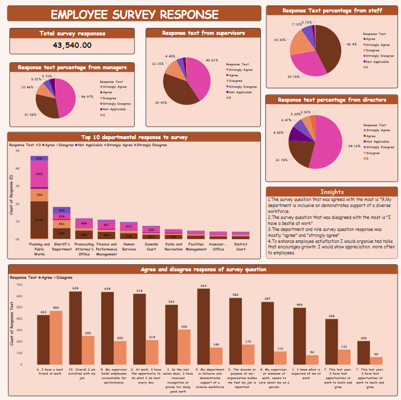

# Employee Survey Response

---

## Introduction
This Power BI project is aimed at exhibiting my skills in analysis and visualization of **Employee survey responses** .
This is my capstone project after learning data analytics

**_Disclaimer_**: _This report is to only demonstrate capabilities in data analytics.Dataset does not represent any organisation or country._

## Problem statement
1.	Which survey question did respondents agree with or disagree with the most?
2.	Do you see any patterns or trends by department or role?
3.	As an employer, what step might you take to improve employee satisfaction on the survey.

## Data sourcing
The link to dataset was in the capstone pdf, downloaded data as excel file then imported to **Power BI** for analysis

## Data Transformation
Data cleaning and transformation was carried with power query. The columns were thoroughly checked out to ensure they were valid and devoid of empty cells and errors. I replaced null values with 0.

## Data modelling
There was no modelling because it was just a table.

## Analysis and visualization

1. The survey question that was agreed with the most is **9.My department is inclusive an demonstrates support of a diverse workforce**.
2. The survey question that was disagreed with the most is **I have a bestie at work**
3. The department and role survey question response was mostly **agree** and **strongly agree**
4. To enhance employee satisfaction I would organise Ted talks that encourages growth among employees. I would also show appreciation more often to employeesfor their good work.

## Conclusion
Showing appreciation to employee and providing helpful informations can greatly improve employee satisfaction

